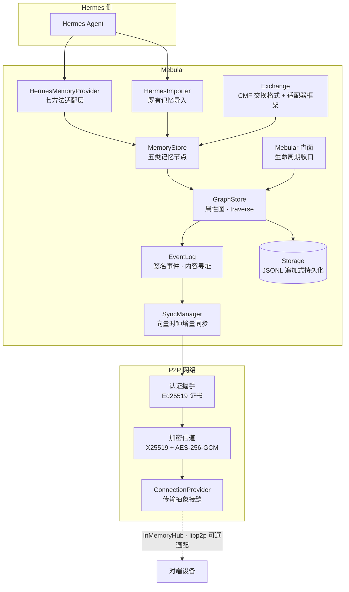

<div align="center">

# 🌌 Mebular

**本地优先的图式记忆系统**
为 Hermes 等 Agent 提供跨设备、可离线、可验证的记忆共享层

[](LICENSE)
[](https://nodejs.org/)
[](https://www.typescriptlang.org/)
[](#验证与质量)
[](#路线图)

</div>

---

记忆以带时间窗的节点/边构成**属性图**；每次变更产生 **Ed25519 签名**的内容寻址事件，经**向量时钟**做增量同步与确定性冲突收敛，设备间通过**认证加密信道**（X25519 + AES-256-GCM）点对点传输——无需中心服务器。

## ✨ 核心特性

| 能力 | 实现 |
|---|---|
| 🔐 **端到端身份与加密** | 用户主密钥签发设备证书；四消息挑战-应答握手防冒名；密钥世代轮换带前向保密 |
| 📡 **离线优先同步** | 推/拉/双向增量同步；离线写入重连自动收敛；冲突按「删除优先 > 时间窗 > LWW」确定性裁决并上报 |
| 🧠 **类型化记忆模型** | Entity / Fact / Episode / Skill / Meta 五类节点；事实带 `validFrom/validTo` 时间有效性 |
| 🤝 **Hermes 集成** | Provider 七方法（store / retrieve / search / extract / profile / history）+ 既有记忆导入器（幂等键随图同步） |
| 🔍 **可插拔召回** | BFS 图遍历 + 零依赖关键词基线；向量索引接口预留，缺省关闭、不伪造相关度 |
| 🌐 **真实网络传输** | libp2p 可选适配器（TCP + Noise + yamux），与 InMemoryHub 同接缝互换；缺包时诚实报错 |
| 🔗 **信任链与跨端互通** | 设备证书链验签收口信任模型 v1；CMF v1 规范交换格式 + 适配器框架，跨端导入幂等 |
| 🪶 **轻依赖** | 运行时仅 `bonjour` + `ulid`；libp2p 栈为可选依赖，按需安装 |

## 🏗 架构总览



## 🚀 快速开始

```bash
npm install
npm run build    # TypeScript strict → dist/
npm test         # Jest 全量：28 套件 / 212 用例
npm run lint     # ESLint（src + tests + scripts）
```

## 📖 用法示例

```ts
import { Mebular, HermesMemoryProvider, HermesImporter, MemoryStore } from 'mebular';

const mebular = new Mebular({
  storagePath: './store.jsonl',
  deviceId: 'device-A',
  encryption: { userMasterKey, userMasterPrivateKey, passphrase }, // 主密钥口令封套存放（可选）
  network: { enabled: true, libp2p: { listen: ['/ip4/0.0.0.0/tcp/0'] } }, // 或 provider: hub 注入自定义传输
  sync: { autoSync: true },
});
await mebular.initialize();

const provider = new HermesMemoryProvider(mebular);

// 写入：fact / preference / observation / skill / episode
await provider.storeMemory({
  type: 'preference',
  content: '深色主题',
  metadata: { preferenceType: 'theme', confidence: 0.9 },
});

// 会话抽取：缺省规则化浅抽取；LLM 深抽取经 options.extractor 注入
const extraction = await provider.extractMemory(sessionData);
await provider.storeExtraction(extraction);

// 检索 / 用户画像 / 会话历史
const { memories } = await provider.retrieveMemory({ types: ['preference'] });
const profile = await provider.getUserProfile();

// 导入 Hermes 既有记忆（MEMORY.md / USER.md / skills / sessions，幂等）
const importer = new HermesImporter(new MemoryStore(mebular.graph));
await importer.importHermesDirectory('~/.hermes');

await mebular.shutdown();
```

## 🗂 目录结构

```
src/
├── mebular.ts      # 门面类：initialize/shutdown 收口全部子系统
├── errors.ts       # 统一错误体系（MebularError + ErrorCodes）
├── types/          # 核心类型（Node / Edge / Event / VectorClock / Traverse）
├── core/           # GraphStore：图存储 + 事件化接线 + traverse
├── crypto/         # Ed25519 签名 · X25519 加密 · IdentityManager 身份证书 · KeyProtector 口令封套
├── storage/        # MemoryStorage · JsonFileStorage（JSONL 追加式）
├── eventlog/       # EventLog：签名事件 · 内容寻址 · 向量时钟合流
├── sync/           # 线协议 · 冲突收敛 · SyncManager（事件信任验签）
├── p2p/            # 握手 · 加密信道 · 连接管理 · NAT · 发现 · 传输抽象 · Libp2pProvider
├── memory/         # MemoryStore 五类节点 + VectorIndex 接口
├── exchange/       # CMF v1 交换格式 + 适配器框架（Hermes / json-memo）
└── hermes/         # HermesMemoryProvider + import/ 既有记忆导入器
tests/              # Jest：单元 + 集成（双设备端到端 · 跨端互通 · 故障注入）
scripts/            # verify-phase0~5 分阶段验证脚本
```

## ✅ 验证与质量

分阶段验证脚本：文件检查 + 编译 + 全量测试 + 实现点抽查 + 构建产物冒烟。

```bash
node scripts/verify-phase5.mjs   # 跨端互通（最新）
node scripts/verify-phase4.mjs   # Hermes 集成
node scripts/verify-phase3.mjs   # 图同步
node scripts/verify-phase2.mjs   # P2P 网络
```

| 指标 | 状态 |
|---|---|
| 测试 | **28 套件 / 212 用例**全绿（单元 + 双设备端到端 + 跨端互通 + 故障注入） |
| 类型 | `tsc --noEmit` strict + `noUncheckedIndexedAccess` 零错误 |
| Lint | ESLint（typescript-eslint）零告警 |
| 质量门禁 | 每个阶段以 verify 脚本 + 构建产物冒烟收尾 |

## 🗺 路线图

| 阶段 | 内容 | 状态 |
|---|---|---|
| Phase 0–1 | 规格定义 · 核心引擎（图存储 / 加密身份 / 事件日志） | ✅ 完成 |
| Phase 2 | P2P 网络（握手 / 信道 / NAT / 发现） | ✅ 完成 |
| Phase 3 | 图同步（签名事件增量同步 / 冲突收敛 / 离线恢复） | ✅ 完成 |
| Phase 4 | Hermes 集成（门面 / 记忆模型 / Provider / 导入器） | ✅ 完成 |
| Phase 5 | 跨端互通（libp2p 真实网络 / 证书链信任 / CMF 交换格式 / 适配器框架 / 故障注入） | ✅ 完成 |
| Phase 6 | 更多异构端适配（Obsidian / 日志型）· 广域网实测 | 📐 规划中 |

## 🤝 贡献

欢迎参与！请先开 Issue 讨论再提交 PR，详见 [CONTRIBUTING.md](CONTRIBUTING.md)。

---

<div align="center">
© 2026 Windsander · MIT License
</div>
