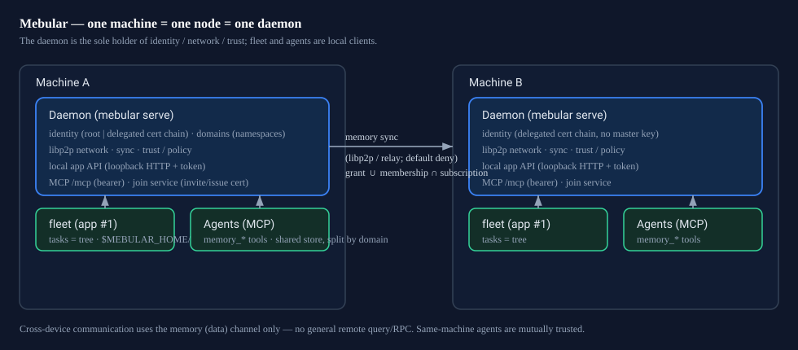

<div align="center">


**A distributed, verifiable memory network for agents.**

Mebular stores memory as a signed knowledge graph: every fact remembers when it is valid and who wrote it.
Devices sync incrementally with vector clocks — offline-friendly, self-converging on reconnect, fully auditable.

[](https://github.com/Windsander/Mebular/actions/workflows/ci.yml)
[](LICENSE)
[](https://nodejs.org/)
[](https://www.typescriptlang.org/)

[Website](https://mebular.cyberfederal.io) · [Why](#why) · [What it is](#what-it-is) · [How to use](#how-to-use) · [What you get](#what-you-get) · [Docs](#links--docs) · [中文](README_CN.md)

</div>

---

## Why

Agent memory usually lives inside one process: a list or a key-value store. Change machines and it is gone;
you cannot tell who wrote what; go offline and it stops working.

| Problem today | Mebular |
|---|---|
| Flat queues, no entities or relations | Graph memory: entity / fact / episode / skill / meta nodes, facts with validity windows |
| Writes cannot be verified | Every write is an Ed25519-signed, content-addressed event — auditable |
| Sync needs a central service | Vector-clock incremental sync, deterministic conflict resolution, offline-capable |
| Isolated ecosystems | A versioned exchange format plus adapters (Obsidian, log journals, json-memo, …) |

## What it is

- **One machine = one node = one daemon.** `mebular serve` is the sole holder of identity, network and trust;
  fleet and agents are local clients sharing that daemon's identity and storage.
- **Domains (namespaces) are data channels.** Joining a domain is a data obligation (receive + promptly sync your
  new local memory). There is no read-only membership and no dispatch semantics in a domain.
- **Tasks are trees.** A task is a DAG: the root is the dispatching agent, children are derived by executors
  (`causedBy`/`chain`, cycle-free). The only remote surface is the memory channel — no general remote query/RPC.
- **Trust is a certificate chain to the user master key.** Any enrolled device may delegate a certificate to a new
  device (bounded chain length); a short-lived, single-use join token lets a new device enroll without copying the
  master key. Revocation cascades to delegated certificates.



## How to use

### For agent users

Point an MCP-capable agent (Claude / Cursor / OpenCode / DeepSeek Harness) at the daemon and use the memory tools
(`memory_write`, `memory_query`, `memory_search`, `memory_status`, …). Every MCP tool has a **verbatim same-named**
`mebular` CLI command (`mebular memory_write`), so scripts and agents share one surface.

```bash
npm install && npm run build
node packages/skill/scripts/install.mjs        # install the skill (opt-in)
mebular mcp                                    # or connect over HTTP: mebular serve
```

### For device owners

One command per machine, then approve once on the first machine:

```bash
fleet quickstart --daemon --dir ~/.mebular --device device-A   # daemon home + fleet + token (+ mebular-serve)
fleet invite --dir ~/.mebular                                  # short-lived join token
# on the new machine (delegated identity, no master key copied):
fleet join --token <token> --daemon --dir ~/.mebular --device device-B
fleet approve --dir ~/.mebular --device device-B               # grant the domain on the graph
```

Prefer a UI? The daemon also serves a local console: run `mebular serve` and open `http://127.0.0.1:7331/console`
(star map / domains / audit / wizard / settings tabs: 常用 / 高级 / 诊断, plus an "关于本机" panel from the top-bar badge; invites carry reachable endpoints so a new device connects without being told an address). Try it with seeded demo data via `seed-demo.mjs`.

### For developers

```ts
import { Mebular, HermesMemoryProvider } from 'mebular';
const mebular = new Mebular({ storagePath: './store.jsonl', deviceId: 'device-A', network: { enabled: false } });
await mebular.initialize();
```

See [`examples/quickstart`](examples/quickstart/index.mjs) to run it. For a fleet task tree, `fleet task_submit`
submits a root and `task_children` / `task_summarize` walk the tree.

## What you get

- **Local-first and offline-capable** — your data stays on your devices; reconnect and it converges.
- **Verifiable, tamper-evident history** — signed, content-addressed events; who changed what is auditable.
- **Graph structure with validity** — relations and time windows, not just a flat store.
- **A real node per machine** — one daemon owns identity/network/trust; agents and fleet share it, split by domain.
- **Decentralized expansion** — any enrolled device can invite; the master key may stay offline.

## Links & docs

- **Limits & trade-offs** — [`LIMITATIONS.md`](LIMITATIONS.md)
- **Sealing contract** (red lines, protocol semantics, deferrals) — [`SEALING.md`](SEALING.md)
- **Fleet runbook** (two-machine ops, WAN commands, acceptance) — [`packages/fleet/RUNBOOK.md`](packages/fleet/RUNBOOK.md)
- **Memory policy for agents** — [`packages/skill/MEMORY_POLICY.md`](packages/skill/MEMORY_POLICY.md)
- **Daemon / MCP** — [`packages/mcp`](packages/mcp) · **Fleet** — [`packages/fleet`](packages/fleet)
- **Console GUI** — [`packages/console`](packages/console) · **Contributing & quality gates** — [`CONTRIBUTING.md`](CONTRIBUTING.md)

<div align="center">

[Website](https://mebular.cyberfederal.io) · [GitHub](https://github.com/Windsander/Mebular) · © 2026 Windsander · MIT License

</div>
