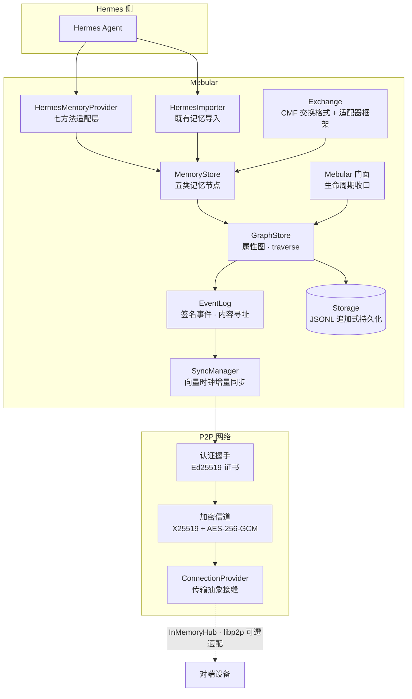

<div align="center">

# 🌌 Mebular

**本地优先的图式记忆系统**
为 Hermes 等 Agent 提供跨设备、可离线、可验证的记忆共享层

[](LICENSE)
[](https://nodejs.org/)
[](https://www.typescriptlang.org/)
[](#验证与质量)
[](#路线图)

</div>

---

记忆以带时间窗的节点/边构成**属性图**；每次变更产生 **Ed25519 签名**的内容寻址事件，经**向量时钟**做增量同步与确定性冲突收敛，设备间通过**认证加密信道**（X25519 + AES-256-GCM）点对点传输——无需中心服务器。

## 它解决什么

多设备之间、甚至同一个 Agent 的不同节点之间，记忆往往散落在各自的文件里，彼此不通、难以验证、更新也不容易收敛。Mebular 想做的，是在 Hermes 以及相似的 Agent 之上提供一层**统一的记忆共享层**：

- **记忆是图，不是扁平队列。** Entity / Fact / Episode / Skill / Meta 五类节点，靠边组织关联——一次存储的事实能自然参与后续的遍历、召回和推理。
- **写入是可验证的事件。** 每一次变更都带 Ed25519 签名和内容寻址，它发生过、没被篡改、是谁写的——这些在多设备、多人协作的时候变得重要。
- **离线优先，同步不靠中心服务器。** 推 / 拉 / 双向增量同步，掉线期间的写入在重连后自动收敛，冲突按确定性规则裁决。
- **与 Hermes 已有的记忆体系尽量兼容。** HermesMemoryProvider 提供七方法适配（store / retrieve / search / extract / profile / history），HermesImporter 能幂等地导入现有的 MEMORY.md / USER.md / skills / sessions，让新系统接入旧记忆成本更低。

如果你只需要一段简短描述：**Mebular 是一个面向 Agent 的本地优先图记忆系统，把记忆存成带签名事件的时间化属性图，用向量时钟做增量同步，让设备之间可以安全地彼此记住同一回事。**

## 安装

目前暂未发布到 npm。从源码构建：

```bash
git clone https://github.com/Windsander/Mebular.git
cd Mebular
npm install
npm run build   # TypeScript strict → dist/
```

运行与验证：

```bash
npm test                # Jest 全量：42 套件 / 313 用例
npm run test:coverage   # 覆盖率（门槛：全库 ≥85% 行 / ≥65% 分支 + 关键文件底线）
npm run lint            # ESLint（src + tests + scripts）
```

库本身运行时仅依赖 `bonjour` + `ulid`；libp2p 栈为可选依赖，按需安装即可启用真实网络传输。

## 最简例子

```ts
import { Mebular, HermesMemoryProvider } from 'mebular';

const mebular = new Mebular({
  storagePath: './store.jsonl',
  deviceId: 'device-A',
  network: { enabled: false }, // 本地单设备先从这里开始
});

await mebular.initialize();
const provider = new HermesMemoryProvider(mebular);

await provider.storeMemory({
  type: 'preference',
  content: '深色主题',
  metadata: { preferenceType: 'theme', confidence: 0.9 },
});

const { memories } = await provider.retrieveMemory({ types: ['preference'] });
console.log(memories);

await mebular.shutdown();
```

只要打开 `network.enabled` 并配置传输，相同的写法就可以跑在两个设备之间、并在重连后自动收敛。

## 核心特性

| 能力 | 实现 |
|---|---|
| 🔐 **端到端身份与加密** | 用户主密钥签发设备证书；四消息挑战-应答握手防冒名；密钥世代轮换带前向保密 |
| 📡 **离线优先同步** | 推/拉/双向增量同步；离线写入重连自动收敛；冲突按「删除优先 > 时间窗 > LWW」确定性裁决并上报 |
| 🧠 **类型化记忆模型** | Entity / Fact / Episode / Skill / Meta 五类节点；事实带 `validFrom/validTo` 时间有效性 |
| 🤝 **Hermes 集成** | Provider 七方法（store / retrieve / search / extract / profile / history）+ 既有记忆导入器（幂等键随图同步） |
| 🔍 **可插拔召回** | BFS 图遍历 + 零依赖关键词基线；向量索引接口预留，缺省关闭、不伪造相关度 |
| 🌐 **真实网络传输** | libp2p 可选适配器（TCP + Noise + yamux），与 InMemoryHub 同接缝互换；缺包时诚实报错 |
| 🔗 **信任链与跨端互通** | 设备证书链验签收口信任模型 v1；CMF v1 规范交换格式 + 适配器框架，跨端导入幂等 |
| 🧩 **生态适配** | Obsidian vault（wiki-link → 关系边，未解析降级成文）与日志型端（append-only → Episode 序列）开箱即通；四端收敛同视图 |
| 🛰 **广域网就绪** | multiaddr 发现桥接（mDNS TXT 发布真实拨号地址）；已确认同步集合持久化，重启后续传零冗余 |
| 🪶 **轻依赖** | 运行时仅 `bonjour` + `ulid`；libp2p 栈为可选依赖，按需安装 |

## 为什么用 Mebular

Mebular 更适合这些情况：

- **设备间的记忆需要彼此信任。** 签名事件 + 证书链让你能区分"这个记忆真的是来自设备 A"和"只是某个节点声称如此"。
- **网络并不总是稳定在线。** 离线优先同步的意思是：允许在没有中心服务器或不稳定广域网的情况下继续写入，等网络恢复后再决定怎么收敛。
- **记忆之间应该有关联，而不是一盘散沙。** 属性图模型让你能按关系遍历记忆，而不只靠关键词或嵌入相似度找回。
- **你已经在用 Hermes 的记忆体系，不想从零开始。** HermesImporter 把已有的记忆文件导入图中，幂等键随图同步，尽量减少手工对齐的工作。

它暂时不适合的情况：

- **需要大规模embedding刷新的记忆系统。** 向量索引接口已经预留，但缺省是关闭的——Mebular 目前更倾向图遍历和确定性规则，而不是靠重算嵌入来驱动召回（更新成本太高）。
- **希望依赖成熟云端记忆服务的场景。** Mebular 是本地优先、点对点的设计，不是托管式记忆 API。

## 架构总览



## 生态与互通

Mebular 不只是一个图存储，它还包含让记忆在不同系统之间交换的格式与适配器：

- **CMF v1 交换格式** —— 规定了一种跨端交换记忆的规范，配合适配器框架让不同来源的记忆能以确定性方式进入图中。
- **Obsidian vault 适配** —— wiki-link 可以变成关系边，无法解析的链接会降级成普通文档，尽量不丢信息。
- **日志型端适配** —— append-only 日志可以转成 Episode 序列，让基于日志的记忆风格也能参与同一张图。
- **四端收敛同步** —— 多个设备同时写入的情况下，按确定性规则收敛到同一视图，并在必要时上报冲突。

## 文档导航

| 内容 | 位置 |
|---|---|
| 核心库（门面 / 图存储 / 事件日志 / 同步 / 加密 / 存储） | `src/`：mebular.ts、core/、crypto/、eventlog/、sync/、storage/ |
| 记忆模型与存储接口 | `src/memory/`、`src/types/` |
| P2P 网络（握手 / 加密信道 / NAT / 发现 / 传输抽象 / libp2p 提供方） | `src/p2p/` |
| CMF 交换格式 + 适配器框架 | `src/exchange/` |
| Hermes 集成（Provider + 导入器） | `src/hermes/` |
| 示例（Obsidian vault / 日志型 / json-memo） | `examples/` |
| 阶段化验证脚本 | `scripts/verify-phase*.mjs` |
| 贡献指南 | [CONTRIBUTING.md](CONTRIBUTING.md) |

## 用法示例

```ts
import { Mebular, HermesMemoryProvider, HermesImporter, MemoryStore } from 'mebular';

const mebular = new Mebular({
  storagePath: './store.jsonl',
  deviceId: 'device-A',
  encryption: { userMasterKey, userMasterPrivateKey, passphrase }, // 主密钥口令封套存放（可选）
  network: { enabled: true, libp2p: { listen: ['/ip4/0.0.0.0/tcp/0'] } }, // 或 provider: hub 注入自定义传输
  sync: { autoSync: true },
});
await mebular.initialize();

const provider = new HermesMemoryProvider(mebular);

// 写入：fact / preference / observation / skill / episode
await provider.storeMemory({
  type: 'preference',
  content: '深色主题',
  metadata: { preferenceType: 'theme', confidence: 0.9 },
});

// 会话抽取：缺省规则化浅抽取；LLM 深抽取经 options.extractor 注入
const extraction = await provider.extractMemory(sessionData);
await provider.storeExtraction(extraction);

// 检索 / 用户画像 / 会话历史
const { memories } = await provider.retrieveMemory({ types: ['preference'] });
const profile = await provider.getUserProfile();

// 导入 Hermes 既有记忆（MEMORY.md / USER.md / skills / sessions，幂等）
const importer = new HermesImporter(new MemoryStore(mebular.graph));
await importer.importHermesDirectory('~/.hermes');

await mebular.shutdown();
```

## 目录结构

```
src/
├── mebular.ts      # 门面类：initialize/shutdown 收口全部子系统
├── errors.ts       # 统一错误体系（MebularError + ErrorCodes）
├── types/          # 核心类型（Node / Edge / Event / VectorClock / Traverse）
├── core/           # GraphStore：图存储 + 事件化接线 + traverse
├── crypto/         # Ed25519 签名 · X25519 加密 · IdentityManager 身份证书 · KeyProtector 口令封套
├── storage/        # MemoryStorage · JsonFileStorage（JSONL 追加式）
├── eventlog/       # EventLog：签名事件 · 内容寻址 · 向量时钟合流
├── sync/           # 线协议 · 冲突收敛 · SyncManager（事件信任验签）
├── p2p/            # 握手 · 加密信道 · 连接管理 · NAT · 发现 · 传输抽象 · Libp2pProvider
├── memory/         # MemoryStore 五类节点 + VectorIndex 接口
├── exchange/       # CMF v1 交换格式 + 适配器框架（Hermes / json-memo / Obsidian / 日志型）
└── hermes/         # HermesMemoryProvider + import/ 既有记忆导入器
tests/              # Jest：单元 + 集成（双设备端到端 · 四端互通 · 故障注入）
scripts/            # verify-phase0~6 分阶段验证脚本
```

## 验证与质量

分阶段验证脚本：文件检查 + 编译 + 全量测试 + 实现点抽查 + 构建产物冒烟。

```bash
node scripts/verify-phase6.mjs   # 质量收口 · 生态适配 · 广域网桥接（最新）
node scripts/verify-phase5.mjs   # 跨端互通
node scripts/verify-phase4.mjs   # Hermes 集成
node scripts/verify-phase3.mjs   # 图同步
node scripts/verify-phase2.mjs   # P2P 网络
```

| 指标 | 状态 |
|---|---|
| 测试 | **42 套件 / 313 用例**全绿（单元 + 双设备端到端 + 四端互通 + 故障注入） |
| 覆盖率 | **90.5% 行 / 77.6% 分支**；门槛化守护（全库 85/65 + 关键文件独立底线） |
| 类型 | `tsc --noEmit` strict + `noUncheckedIndexedAccess` 零错误 |
| Lint | ESLint（typescript-eslint）零告警 |
| 质量门禁 | 每个阶段以 verify 脚本 + 构建产物冒烟收尾；src 内裸 `throw new Error` 清零 |

## 路线图

| 阶段 | 内容 | 状态 |
|---|---|---|
| Phase 0–1 | 规格定义 · 核心引擎（图存储 / 加密身份 / 事件日志） | ✅ 完成 |
| Phase 2 | P2P 网络（握手 / 信道 / NAT / 发现） | ✅ 完成 |
| Phase 3 | 图同步（签名事件增量同步 / 冲突收敛 / 离线恢复） | ✅ 完成 |
| Phase 4 | Hermes 集成（门面 / 记忆模型 / Provider / 导入器） | ✅ 完成 |
| Phase 5 | 跨端互通（libp2p 真实网络 / 证书链信任 / CMF 交换格式 / 适配器框架 / 故障注入） | ✅ 完成 |
| Phase 6 | 质量收口（死代码清零 / 错误体系注册 / 覆盖门槛）· 生态适配（Obsidian / 日志型）· 广域网桥接（multiaddr 发现 / 同步状态持久化） | ✅ 完成 |
| Phase 7+ | 信任模型 v2（证书吊销）· 本地 embedding 向量召回 · 跨 NAT 双机实测回填 | 📐 候选 |

## 🤝 贡献

欢迎参与！请先开 Issue 讨论再提交 PR，详见 [CONTRIBUTING.md](CONTRIBUTING.md)。

---

<div align="center">
© 2026 Windsander · MIT License
</div>
