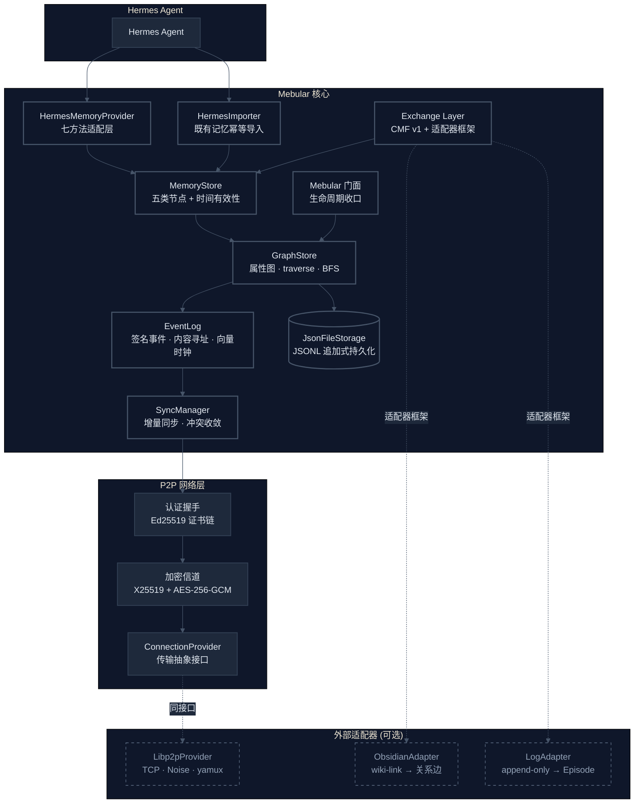

<div align="center">

# 🌌 Mebular

**面向 Agent 的本地优先图记忆系统**  
把记忆存成带签名事件的时间化属性图，用向量时钟做增量同步，让设备之间可以安全地彼此记住同一回事

[](LICENSE)
[](https://nodejs.org/)
[](https://www.typescriptlang.org/)
[](#验证与质量)

</div>

---

## 为什么需要 Mebular？

当前 Agent 记忆面临四个结构性问题：

| 痛点 | 现状 | 后果 |
|------|------|------|
| **记忆是扁平队列** | 以列表/键值存储，缺乏实体-关系结构 | 无法做多跳推理、关联召回、时间有效性判断 |
| **写入不可验证** | 无签名、无内容寻址、无作者身份 | 多设备/多用户协作时，无法区分"真实记忆"与"伪造/篡改" |
| **同步依赖中心服务** | 必须在线、必须信任中间商 | 离线即失效、隐私泄露、单点故障 |
| **生态孤岛** | Hermes、mem0、Zep、Graphiti 互不互通 | 迁移成本高、数据被锁死 |

Mebular 的定位：**在 Hermes 等 Agent 之上，提供一层统一、可验证、离线优先、跨设备同步的记忆共享层。**

---

## 核心能力一览

| 能力 | 实现方式 |
|------|----------|
| **图式记忆模型** | Entity / Fact / Episode / Skill / Meta 五类节点 + `validFrom/validTo` 时间有效性边 |
| **可验证事件日志** | 每次变更 → Ed25519 签名 + 内容寻址（Blake3）事件，写入即留证 |
| **离线优先同步** | 推/拉/双向增量同步，向量时钟收敛，冲突按「删除优先 > 时间窗 > LWW」确定性裁决 |
| **端到端加密传输** | X25519 + AES-256-GCM 认证加密信道，设备证书链验签收口信任模型 v1 |
| **Hermes 原生集成** | Provider 七方法 + 幂等导入器，旧记忆（MEMORY.md/USER.md/skills/sessions）零成本接入 |
| **跨端互通格式** | CMF v1 交换格式 + 适配器框架（Obsidian vault / 日志型端 / json-memo） |
| **真实网络传输** | libp2p 可选适配器（TCP + Noise + yamux），与 InMemoryHub 同接口无缝互换 |

> **一句话**：Mebular 让记忆成为**可验证、可关联、可同步、可迁移**的第一类公民。

---

## 30 秒上手

```bash
# 暂未发布 npm，从源码构建
git clone https://github.com/Windsander/Mebular.git
cd Mebular
npm install
npm run build          # TypeScript strict → dist/
npm test               # 42 套件 / 313 用例全绿
```

运行时仅依赖 `bonjour` + `ulid`；libp2p 为可选依赖，按需启用。

---

## 最简例子（复制即跑）

```ts
import { Mebular, HermesMemoryProvider } from 'mebular';

const mebular = new Mebular({
  storagePath: './store.jsonl',
  deviceId: 'device-A',
  network: { enabled: false }, // 单设备先从这里开始
});

await mebular.initialize();
const provider = new HermesMemoryProvider(mebular);

await provider.storeMemory({
  type: 'preference',
  content: '深色主题',
  metadata: { preferenceType: 'theme', confidence: 0.9 },
});

const { memories } = await provider.retrieveMemory({ types: ['preference'] });
console.log(memories); // → [ { type: 'preference', content: '深色主题', ... } ]

await mebular.shutdown();
```

把 `network.enabled: true` 并配置传输，相同代码即可跑在两设备间、重连后自动收敛。

---

## 系统架构



**三层解耦**：
- **Hermes 侧**：仅依赖 Provider/Importer 接口，零耦合核心实现
- **Mebular 核心**：图存储、事件日志、同步管理、持久化——纯 TS、零网络依赖
- **P2P 网络层**：握手、加密信道、传输抽象——可替换为 libp2p / InMemoryHub / 自定义实现

---

## 文档导航

| 方向 | 入口 |
|------|------|
| **核心 API** | `src/mebular.ts` · `src/types/` |
| **记忆模型 & 存储** | `src/memory/` · `src/core/` · `src/storage/` |
| **P2P 网络 & 同步** | `src/p2p/` · `src/sync/` · `src/eventlog/` |
| **CMF 交换 & 适配器** | `src/exchange/` |
| **Hermes 集成** | `src/hermes/` |
| **验证脚本** | `scripts/verify-phase0.mjs` ~ `verify-phase6.mjs` |
| **贡献指南** | [CONTRIBUTING.md](CONTRIBUTING.md) |

---

## 验证与质量

```bash
# 分阶段验证（每阶段：文件检查 + 编译 + 全量测试 + 实现点抽查 + 构建产物冒烟）
node scripts/verify-phase6.mjs   # 质量收口 · 生态适配 · 广域网桥接
node scripts/verify-phase5.mjs   # 跨端互通
node scripts/verify-phase4.mjs   # Hermes 集成
node scripts/verify-phase3.mjs   # 图同步
node scripts/verify-phase2.mjs   # P2P 网络
```

| 指标 | 状态 |
|------|------|
| 测试 | **42 套件 / 313 用例**全绿（单元 + 双设备端到端 + 四端互通 + 故障注入） |
| 覆盖率 | **90.5% 行 / 77.6% 分支**（全库 ≥85/65 + 关键文件独立底线） |
| 类型检查 | `tsc --noEmit` strict + `noUncheckedIndexedAccess` 零错误 |
| Lint | ESLint (typescript-eslint) 零告警 |
| 质量门禁 | 每阶段 verify 脚本 + 冒烟收尾；src 内裸 `throw new Error` 清零 |

---

## 项目状态

> **早期设计阶段** — 核心功能已可用（Phase 0-6 完成），但 API 尚未稳定，未发布 npm 包，生产环境使用请谨慎评估。

| 里程碑 | 状态 |
|--------|------|
| 核心引擎（图存储 / 加密身份 / 事件日志） | ✅ 完成 |
| P2P 网络（握手 / 信道 / NAT / 发现） | ✅ 完成 |
| 图同步（增量同步 / 冲突收敛 / 离线恢复） | ✅ 完成 |
| Hermes 集成（门面 / Provider / 导入器） | ✅ 完成 |
| 跨端互通（证书链 / CMF / 适配器 / 故障注入） | ✅ 完成 |
| 质量收口 · 生态适配 · 广域网桥接 | ✅ 完成 |
| 信任模型 v2 / 本地 embedding / 跨 NAT 实测 | 📐 规划中 |

---

## 贡献

欢迎参与！请先开 Issue 讨论再提交 PR，详见 [CONTRIBUTING.md](CONTRIBUTING.md)。

---

<div align="center">
© 2026 Windsander · MIT License
</div>