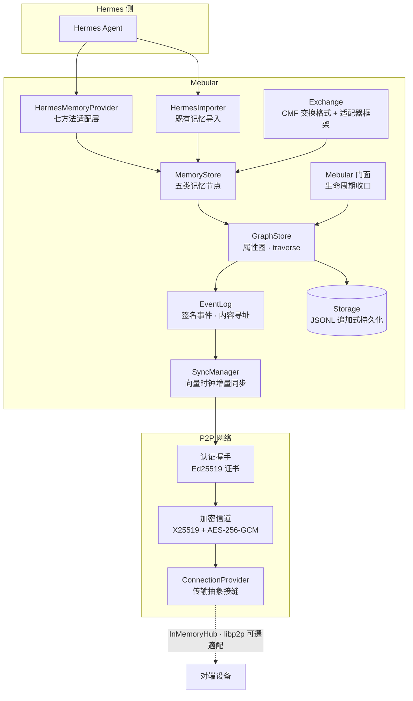

<div align="center">

# 🌌 Mebular

**面向 Agent 的本地优先图记忆系统**  
把记忆存成带签名事件的时间化属性图，用向量时钟做增量同步，让设备之间可以安全地彼此记住同一回事

[](LICENSE)
[](https://nodejs.org/)
[](https://www.typescriptlang.org/)
[](#验证与质量)
[](#路线图)

</div>

---

## 问题：为什么需要 Mebular？

多设备之间、甚至同一个 Agent 的不同节点之间，记忆往往散落在各自的文件里，彼此不通、难以验证、更新也不容易收敛。

- 记忆是**扁平队列**，缺乏关联与推理结构  
- 写入**不可验证**：谁写的、有没有被改、哪个版本是真的？  
- 同步**依赖中心服务器**，离线即瘫痪，冲突无确定性裁决  
- 现有 Agent 记忆（Hermes 等）孤岛化，迁移成本高

## 方案：Mebular 做什么

| 核心能力 | 实现要点 |
|----------|----------|
| **图式记忆模型** | Entity / Fact / Episode / Skill / Meta 五类节点 + 带时间有效性的边 |
| **可验证事件** | 每次变更产生 Ed25519 签名的内容寻址事件，写入即留证 |
| **离线优先同步** | 推/拉/双向增量同步，向量时钟收敛，冲突按确定性规则裁决 |
| **端到端加密** | X25519 + AES-256-GCM 认证加密信道，设备证书链验签收口信任 |
| **Hermes 原生集成** | Provider 七方法 + 幂等导入器，旧记忆零成本接入 |
| **跨端互通格式** | CMF v1 交换格式 + 适配器框架（Obsidian / 日志型 / json-memo） |
| **真实网络传输** | libp2p 可选适配器（TCP + Noise + yamux），与 InMemoryHub 同接缝互换 |

> **一句话**：Mebular 为 Hermes 等 Agent 提供一层**统一、可验证、离线优先、跨设备同步**的记忆共享层。

## 快速开始

```bash
# 暂未发布 npm，从源码构建
git clone https://github.com/Windsander/Mebular.git
cd Mebular
npm install
npm run build          # TypeScript strict → dist/
npm test               # 42 套件 / 313 用例
```

运行时仅依赖 `bonjour` + `ulid`；libp2p 为可选依赖，按需启用。

## 最简例子（复制即跑）

```ts
import { Mebular, HermesMemoryProvider } from 'mebular';

const mebular = new Mebular({
  storagePath: './store.jsonl',
  deviceId: 'device-A',
  network: { enabled: false }, // 单设备先从这里开始
});

await mebular.initialize();
const provider = new HermesMemoryProvider(mebular);

await provider.storeMemory({
  type: 'preference',
  content: '深色主题',
  metadata: { preferenceType: 'theme', confidence: 0.9 },
});

const { memories } = await provider.retrieveMemory({ types: ['preference'] });
console.log(memories); // → [ { type: 'preference', content: '深色主题', ... } ]

await mebular.shutdown();
```

把 `network.enabled: true` 并配置传输，相同代码即可跑在两设备间、重连后自动收敛。

## 架构总览



## 文档导航

| 方向 | 入口 |
|------|------|
| 核心库 API | `src/mebular.ts` · `src/types/` |
| 记忆模型 & 存储 | `src/memory/` · `src/core/` · `src/storage/` |
| P2P 网络 & 同步 | `src/p2p/` · `src/sync/` · `src/eventlog/` |
| CMF 交换 & 适配器 | `src/exchange/` |
| Hermes 集成 | `src/hermes/` |
| 阶段化验证脚本 | `scripts/verify-phase0~6.mjs` |
| 完整用法示例 | 见下文「用法示例」节 |
| 贡献指南 | [CONTRIBUTING.md](CONTRIBUTING.md) |

## 验证与质量

```bash
node scripts/verify-phase6.mjs   # 质量收口 · 生态适配 · 广域网桥接（最新）
node scripts/verify-phase5.mjs   # 跨端互通
node scripts/verify-phase4.mjs   # Hermes 集成
node scripts/verify-phase3.mjs   # 图同步
node scripts/verify-phase2.mjs   # P2P 网络
```

| 指标 | 状态 |
|------|------|
| 测试 | **42 套件 / 313 用例**全绿（单元 + 双设备端到端 + 四端互通 + 故障注入） |
| 覆盖率 | **90.5% 行 / 77.6% 分支**；门槛化守护（全库 85/65 + 关键文件独立底线） |
| 类型 | `tsc --noEmit` strict + `noUncheckedIndexedAccess` 零错误 |
| Lint | ESLint（typescript-eslint）零告警 |
| 质量门禁 | 每阶段以 verify 脚本 + 构建产物冒烟收尾；src 内裸 `throw new Error` 清零 |

## 路线图

| 阶段 | 内容 | 状态 |
|------|------|------|
| Phase 0–1 | 规格定义 · 核心引擎（图存储 / 加密身份 / 事件日志） | ✅ 完成 |
| Phase 2 | P2P 网络（握手 / 信道 / NAT / 发现） | ✅ 完成 |
| Phase 3 | 图同步（签名事件增量同步 / 冲突收敛 / 离线恢复） | ✅ 完成 |
| Phase 4 | Hermes 集成（门面 / 记忆模型 / Provider / 导入器） | ✅ 完成 |
| Phase 5 | 跨端互通（libp2p 真实网络 / 证书链信任 / CMF / 适配器 / 故障注入） | ✅ 完成 |
| Phase 6 | 质量收口 · 生态适配（Obsidian / 日志型） · 广域网桥接 | ✅ 完成 |
| Phase 7+ | 信任模型 v2（证书吊销） · 本地 embedding 向量召回 · 跨 NAT 双机实测回填 | 📐 候选 |

## 贡献

欢迎参与！请先开 Issue 讨论再提交 PR，详见 [CONTRIBUTING.md](CONTRIBUTING.md)。

---

<div align="center">
© 2026 Windsander · MIT License
</div>