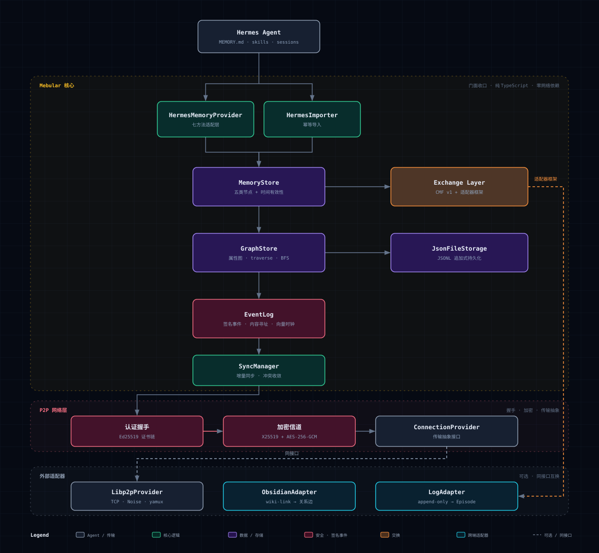

<div align="center">


# Mebular

**面向 Agent 的分布式图记忆网络**

Mebular 把记忆存成一张带签名事件的知识图谱，每条事实都记得自己什么时候有效、由谁写入。设备之间用向量时钟做增量同步，离线也能用，重连后自动收敛，改过什么都能查。

[](https://mebular.cyberfederal.io)
[](https://github.com/Windsander/Mebular)

[](LICENSE)
[](https://nodejs.org/)
[](https://www.typescriptlang.org/)
[](#项目状态)
[](#项目状态)

[官网](https://mebular.cyberfederal.io) · [快速上手](#30-秒上手) · [系统架构](#系统架构) · [项目状态](#项目状态) · [贡献](#贡献)

</div>

---

## 为什么需要 Mebular？

Agent 的记忆大多还躺在单个进程里：一个列表或键值存储，换台设备就断了，被谁改过也说不清，离线直接罢工。具体来说有四个问题。

| 问题 | 现在的做法 | Mebular 的做法 |
|------|-----------|----------------|
| 记忆是扁平队列 | 用列表或键值对存，没有实体和关系 | 图式记忆模型：Entity / Fact / Episode / Skill / Meta 五类节点，事实带 `validFrom / validTo` 有效期 |
| 写入不可验证 | 没有签名、没有内容寻址，也认不出作者 | 每次写入生成一条 Ed25519 签名、Blake3 寻址的事件，改了什么、谁改的都能查 |
| 同步依赖中心服务 | 必须在线，还要信任中间商 | 向量时钟做增量同步，冲突按「删除优先 > 时间窗 > LWW」裁决，离线可用 |
| 生态各自为政 | Hermes、mem0、Zep、Graphiti 之间不互通 | CMF v1 交换格式加适配器，Obsidian、日志型端、json-memo 都能接 |

除这四点之外，还带了 X25519 + AES-256-GCM 的加密信道、Hermes 的七方法 Provider 和幂等导入、可选的 libp2p 真实网络，以及一套带覆盖率门槛的测试。

---

## 30 秒上手

还没发 npm 包，先从源码构建。运行时只依赖 `bonjour` 和 `ulid`，libp2p 是可选的。

```bash
git clone https://github.com/Windsander/Mebular.git
cd Mebular
npm install
npm run build          # TypeScript strict → dist/
npm test               # 42 套件 / 313 用例全绿
```

### 最简例子（复制即跑）

```ts
import { Mebular, HermesMemoryProvider } from 'mebular';

const mebular = new Mebular({
  storagePath: './store.jsonl',
  deviceId: 'device-A',
  network: { enabled: false }, // 单设备先从这里开始
});

await mebular.initialize();
const provider = new HermesMemoryProvider(mebular);

await provider.storeMemory({
  type: 'preference',
  content: '深色主题',
  metadata: { preferenceType: 'theme', confidence: 0.9 },
});

const { memories } = await provider.retrieveMemory({ types: ['preference'] });
console.log(memories); // → [ { type: 'preference', content: '深色主题', ... } ]

await mebular.shutdown();
```

把 `network.enabled` 改成 `true` 并配置传输，同一段代码就能跑在两台设备上，断线重连后自己收敛。

`examples/` 里还有三个能直接跑的：`obsidian-vault`、`log-journal`、`json-memo`。

---

## 系统架构



图分三层，层与层之间只靠接口耦合：

- Hermes 侧只依赖 Provider 和 Importer 接口，不碰核心实现。
- 核心层负责图存储、事件日志、同步和持久化，纯 TypeScript，不依赖网络。
- P2P 层管握手、加密信道和传输抽象，可以换成 libp2p、InMemoryHub 或自己实现。

矢量源文件在 [`assets/architecture.svg`](assets/architecture.svg)，独立页面在 [`assets/architecture.html`](assets/architecture.html)，克隆到本地直接打开就能看。

---

## 适用与取舍

Mebular 没走云端记忆 SaaS 那条路，也就有相应的代价。

| 更看重 | 代价 |
|--------|------|
| 离线可用、数据自己拿着 | 不做 SaaS，节点要自己跑 |
| 写入可验证、抗篡改 | 每次写入多出签名和哈希的开销 |
| 图结构、能表达关系和时效 | 比扁平键值模型复杂，上手要花点时间 |
| 生态互通、方便迁移 | 功能还没成熟方案全 |

适合愿意自己管数据、要在多台设备或多端之间共享 Agent 记忆、也能接受早期项目的人。想开箱即用，或者要生产级 SLA 的，现在还不合适。

---

## 项目状态

Mebular 还在早期设计阶段。Phase 0 到 6 的功能都能用了，但 API 还没稳定，也没发 npm 包，放到生产环境前请自己评估。

| 里程碑 | 状态 |
|--------|------|
| 核心引擎（图存储 / 加密身份 / 事件日志） | 完成 |
| P2P 网络（握手 / 信道 / NAT / 发现） | 完成 |
| 图同步（增量同步 / 冲突收敛 / 离线恢复） | 完成 |
| Hermes 集成（门面 / Provider / 导入器） | 完成 |
| 跨端互通（证书链 / CMF / 适配器 / 故障注入） | 完成 |
| 质量收口、生态适配、广域网桥接 | 完成 |
| 信任模型 v2（证书吊销）、本地 embedding 召回、跨 NAT 实测回填 | 规划中 |

测试和质量方面：

| 项目 | 情况 |
|------|------|
| 测试 | 42 个套件、313 条用例全绿，覆盖单元、双设备端到端、四端互通和故障注入 |
| 覆盖率 | 行 90.5%、分支 77.6%，全库门槛 85/65，关键文件另有底线 |
| 类型检查 | `tsc --noEmit`，strict 加 `noUncheckedIndexedAccess`，零错误 |
| Lint | ESLint（typescript-eslint）零告警 |
| 质量门禁 | 每个阶段跑 verify 脚本加构建产物冒烟，`src` 里不留裸的 `throw new Error` |

<details>
<summary>分阶段验证脚本</summary>

```bash
# 每阶段：文件检查 + 编译 + 全量测试 + 实现点抽查 + 构建产物冒烟
node scripts/verify-phase6.mjs   # 质量收口 · 生态适配 · 广域网桥接
node scripts/verify-phase5.mjs   # 跨端互通
node scripts/verify-phase4.mjs   # Hermes 集成
node scripts/verify-phase3.mjs   # 图同步
node scripts/verify-phase2.mjs   # P2P 网络
```

</details>

---

## 文档导航

| 方向 | 入口 |
|------|------|
| 核心 API | [`src/mebular.ts`](src/mebular.ts) · [`src/types/`](src/types) |
| 记忆模型和存储 | [`src/memory/`](src/memory) · [`src/core/`](src/core) · [`src/storage/`](src/storage) |
| P2P 网络和同步 | [`src/p2p/`](src/p2p) · [`src/sync/`](src/sync) · [`src/eventlog/`](src/eventlog) |
| CMF 交换和适配器 | [`src/exchange/`](src/exchange) |
| Hermes 集成 | [`src/hermes/`](src/hermes) |
| 可运行示例 | [`examples/`](examples) |
| 贡献指南 | [CONTRIBUTING.md](CONTRIBUTING.md) |

---

## 贡献

想参与就开个 Issue 先聊聊，再发 PR，具体约定见 [CONTRIBUTING.md](CONTRIBUTING.md)。

觉得有用的话，点个 star。

---

<div align="center">

[官网](https://mebular.cyberfederal.io) · [GitHub](https://github.com/Windsander/Mebular) · © 2026 Windsander · MIT License

</div>
