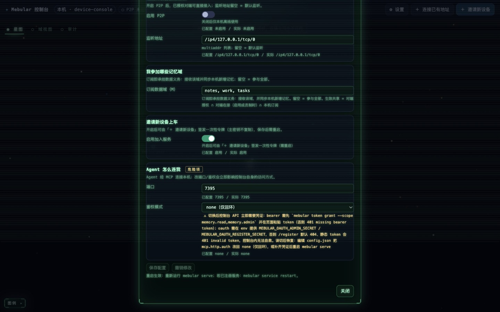
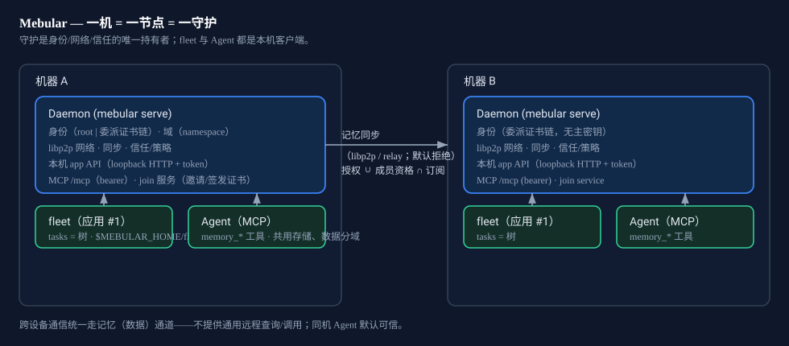
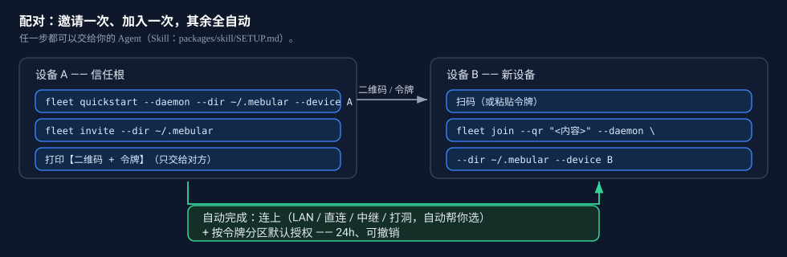

<div align="center">


**一份记忆，所有设备、所有 Agent——去中心化、离线优先。**

Mebular 是你 Agent 的去中心化记忆网络：数据只留在你自己的设备上——没有云、没有协调者，**没有中心可被攻破**。每条事实都记得**自己何时有效、由谁写入**；设备离线照常工作，重连自动收敛。

[](https://github.com/Windsander/Mebular/actions/workflows/ci.yml)
[](LICENSE)
[](https://nodejs.org/)
[](https://www.typescriptlang.org/)

[官网](https://mebular.cyberfederal.io) · [为什么](#为什么) · [是什么](#是什么) · [怎么用](#怎么用) · [带来什么](#带来什么) · [文档](#链接与文档) · [English](README.md)

</div>

---

<p align="center">
  
  
</p>
<p align="center"><sub>星图与「关于本机」 · 设置（均为实机界面）</sub></p>

## 为什么

Agent 的记忆大多还躺在单个进程里：一个列表或键值存储，换台设备就断了，被谁改过也说不清，离线直接罢工。

| 问题 | Mebular 的做法 |
|---|---|
| 扁平队列，没有实体与关系 | 图式记忆：实体 / 事实 / 情节 / 技能 / 元数据五类节点，事实带有效期 |
| 写入不可验证 | 随时能查出谁改了什么——每次写入都是 Ed25519 签名、内容寻址的事件 |
| 同步依赖中心服务 | 不依赖中心服务——向量时钟增量同步，离线后重连自动收敛 |
| 生态各自为政 | 记忆可带走——版本化交换格式 + 适配器（Obsidian、日志型端、json-memo…） |

## 是什么

- **配对一次，其余全自动。** 扫二维码（或令牌）即可入网——不复制主密钥、不用配地址。记忆归 Agent 管，连接/同步/信任在后台自动跑。
- **一机 = 一节点 = 一守护。** `mebular serve` 是身份/网络/信任的唯一持有者；fleet 与 Agent 都是本机客户端，共用守护的身份与存储。
- **域（namespace）= 记忆数据通道。** 参与即**数据义务**（收 + 及时同步本地新记忆）；不存在只读参与，域内也不含派发语义。
- **任务 = 树。** 任务是一棵 DAG：root 是派发者，子任务由执行者派生（`causedBy`/`chain`，禁环）。唯一远程面就是记忆通道——不提供通用远程查询/调用。
- **信任 = 链到用户主密钥的证书链。** 任意在册设备都可为新设备签发委派证书（链长有界）；短时效、一次性的加入令牌让新设备**无需复制主密钥**即可入网；吊销会级联到委派证书。



## 怎么用


### 开始用
| 路径 | 怎么开始 | 适合 |
|---|---|---|
| **让 Agent 代劳**（推荐） | 装好 Skill，然后说“部署 Mebular”/“用这个码加入” | 不想碰命令 |
| **GUI** | `mebular serve` → 控制台 → 首次：**建新 / 加入已有**；之后：＋ 邀请新设备 | 想亲眼看着 |
| **CLI** | `fleet quickstart` → `fleet invite`；新机 `fleet join --qr` | 脚本化/批量 |

**让 Agent 代劳** —— 装好 Skill，对它说“部署 Mebular”/“用这个码加入”；它按 [`packages/skill/SETUP.md`](packages/skill/SETUP.md) 执行并用 `mebular doctor --net` 自检：

```bash
node packages/skill/scripts/install.mjs
```

**GUI** —— 控制台在 `http://127.0.0.1:7331/console`。家目录为空时先进入**首次上手页**，两个入口：**建新 Mebular**（root 身份 + 写配置，随后自动重启）或**加入已有 Mebular**（粘贴邀请令牌，取回委派证书，**不复制主密钥**）。完成后点「＋ 邀请新设备」即可用同样方式接入下一台机器：

```bash
mebular serve
```

**CLI** —— 建新 / 邀请 / 加入这三条命令：

```bash
fleet quickstart --daemon --dir ~/.mebular --device device-A   # 身份 + 守护 + 加入服务
fleet invite --dir ~/.mebular                                  # 给新设备的二维码 + 令牌
fleet join --qr "<二维码内容>" --daemon --dir ~/.mebular --device device-B   # 也可用 --token
```

首次上手全程 GUI（**建新** / **加入已有** —— 粘贴令牌即可，不需要命令行） · 命令行仍保留给脚本（`fleet join`） · 默认无需 `fleet approve` · 授权默认 24h、可撤销 · 想先看界面用 `seed-demo.mjs`

### 谁做什么
| 谁 | 管什么 | 代表命令 |
|---|---|---|
| **你的 Agent**（你不碰） | 记忆读写/检索、任务执行与结果回传 | `memory_write` …（全表见 skill 文档） |
| **你**（很少） | 配对一次；授权/撤销/退订/重入；看状态；（可选）派活 | `fleet invite` · `fleet revoke` · `fleet task_submit` |
| **框架**（自动） | 连接寻址、直连/中继/打洞切换、自动当桥、同步重试、证书与令牌 TTL、服务自启 | — |

唯一需你物理决定：两个网络都无公网入口时，自备一台可达设备当桥（配对进来即自动生效）。

### 扩展它（开发者）

```ts
import { Mebular, HermesMemoryProvider } from 'mebular';
const mebular = new Mebular({
  storagePath: './store.jsonl', deviceId: 'device-A', network: { enabled: false },
});
await mebular.initialize();
```

可运行示例：[`examples/quickstart`](examples/quickstart/index.mjs) —— 用 `task_submit` 提交一个根任务。

## 带来什么

- **本地优先、离线可用**：数据留在你的设备上；重连即收敛。
- **可验证、抗篡改的历史**：签名 + 内容寻址事件，谁改了什么可审计。
- **带时效的图结构**：关系与时间窗，而不只是扁平存储。
- **每台机器一个真正的节点**：一个守护持有身份/网络/信任，Agent 与 fleet 共用、按域分隔。
- **去中心化扩容**：任意在册设备都能邀请；主密钥可保持离线。

## 链接与文档

- **快速上手（5 分钟）** — [`QUICKSTART_CN.md`](QUICKSTART_CN.md) · [English](QUICKSTART.md)
- **限制与取舍** — [`LIMITATIONS_CN.md`](LIMITATIONS_CN.md)
- **封板契约**（红线 / 协议语义 / 推迟项） — [`SEALING_CN.md`](SEALING_CN.md)
- **fleet 运维手册**（双机操作、WAN 命令、验收） — [`packages/fleet/RUNBOOK.md`](packages/fleet/RUNBOOK.md)
- **Agent 记忆规约** — [`packages/skill/MEMORY_POLICY.md`](packages/skill/MEMORY_POLICY.md)
- **守护 / MCP** — [`packages/mcp`](packages/mcp)
- **Fleet** — [`packages/fleet`](packages/fleet)
- **控制台 GUI** — [`packages/console`](packages/console)
- **贡献与质量门禁** — [`CONTRIBUTING.md`](CONTRIBUTING.md)

<div align="center">

[官网](https://mebular.cyberfederal.io) · [GitHub](https://github.com/Windsander/Mebular) · © 2026 Windsander · MIT License

</div>
